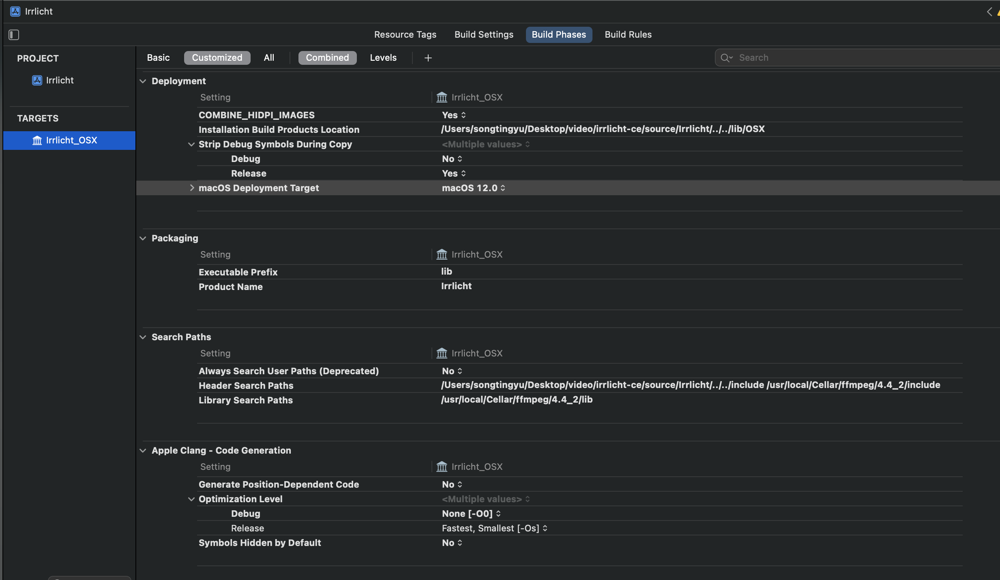
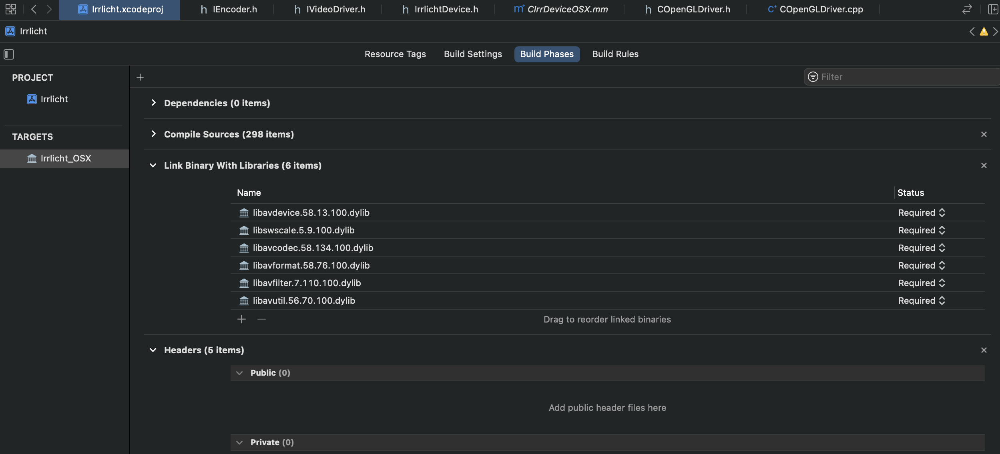

## BUILD

This is a tutorial on how to build the engine on different platforms.

### 1 MacOS

Please open the source/Irrlicht/Irrlicht.xcodeproj.

And you should adjust the header file and lib file of ffmpeg. Also, some static library should be pointed out.

**Please note the Search Paths, you should adjust it according to where you install the ffmpeg**

**Please link these dynamic libraries. And for the libavfilter etc., they are in the /usr/local/Cellar/ffmpeg/4.4_2/lib, and /usr/local/Cellar/ffmpeg/4.4_2 is where I installed the ffmpeg.**

And if you wanna test the new function, please open the /examples/02.Quake3Map/Quake3Map.xcodeproj,  , please also add the dynamic libraries. It will record the game to a video which names "output.h264".

